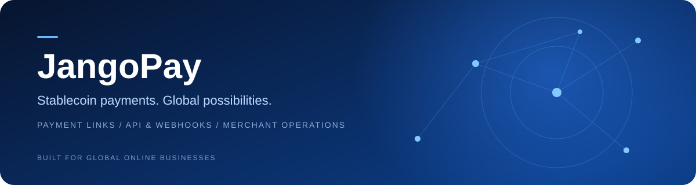
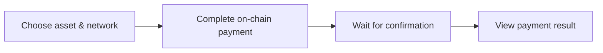

<a href="README.zh-CN.md">简体中文</a> · <a href="https://www.jangopay.org/">Website</a> · <a href="mailto:contact@jangopay.org">Contact</a>

<h1 align="center">Payments that connect your business to the world.</h1>

Stablecoin payment tools for Chinese-speaking merchants, global businesses and developers.

---

## Build your payment flow with JangoPay

Accept stablecoin and cryptocurrency payments through payment links, connect payment status to your own systems, and manage collections, assets and customer insights in one merchant workspace.

| Start collecting | Connect your systems | Run your operations |
| :--- | :--- | :--- |
| **Payment links** — create a payment page and share it with customers, without building a checkout from scratch. | **API & Webhooks** — connect payment creation and status notifications to websites, applications and business backends. | **Merchant workspace** — follow collection status, balances, transfers and customer activity. |

## Built around real online businesses

AI tools & SaaS · Digital content · Cross-border commerce · Hosting & network services · Gaming & virtual goods · Top-ups & vouchers · Booking · Platform operations.

Product availability, supported assets, networks and fees are subject to the current JangoPay product and account settings.

## Explore our repositories

| Repository | What you will find |
| :--- | :--- |
| [**jangopay-docs**](https://github.com/jangopay/jangopay-docs) | Bilingual product guides, payment flows and integration planning. |
| [**jangopay-examples**](https://github.com/jangopay/jangopay-examples) | Workflow recipes and launch checklists for merchant integrations. |

## A clear customer experience

## Stay connected

[Website](https://www.jangopay.org/) · [X](https://x.com/JangoPayGlobal) · [Telegram](https://t.me/jangopay) · [Medium](https://jangopay.medium.com/)

**Product questions, integrations and partnerships:** [contact@jangopay.org](mailto:contact@jangopay.org)

These repositories document JangoPay’s public product experience. They do not open-source the payment backend or constitute an official SDK/API contract.
