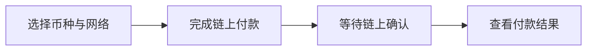

<a href="README.md">English</a> · <a href="https://www.jangopay.org/">Website</a> · <a href="mailto:contact@jangopay.org">Contact</a>

<h1 align="center">让你的业务，连接全球付款。</h1>

面向华语商户、全球在线业务与开发者的稳定币支付工具。

---

## 用 JangoPay 构建更清晰的支付流程

通过收款链接接收稳定币与加密货币付款，将支付状态接入业务系统，在统一的商户后台管理收款、资产与客户数据。

| 快速开始收款 | 连接业务系统 | 管理支付运营 |
| :--- | :--- | :--- |
| **收款链接** — 创建付款页面并分享给客户，无需从零开发结账页。 | **API 与 Webhook** — 将订单创建、收款状态与通知连接到网站、应用或业务后台。 | **商户工作台** — 查看收款状态、币种余额、资产转出与客户活动。 |

## 面向真实的在线业务

AI 工具与 SaaS · 数字内容 · 跨境电商 · 服务器与网络 · 游戏与虚拟商品 · 充值与卡券 · 预订 · 平台运营。

具体产品能力、支持币种、网络与费用，以当前正式产品及账户设置为准。

## 了解我们的仓库

| 仓库 | 内容 |
| :--- | :--- |
| [**jangopay-docs**](https://github.com/jangopay/jangopay-docs) | 中英文产品说明、付款流程与接入规划。 |
| [**jangopay-examples**](https://github.com/jangopay/jangopay-examples) | 商户接入流程模板与上线检查清单。 |

## 客户付款，步骤清晰

## 联系 JangoPay

[官网](https://www.jangopay.org/) · [X](https://x.com/JangoPayGlobal) · [Telegram](https://t.me/jangopay) · [Medium](https://jangopay.medium.com/)

**产品咨询、技术接入与商务合作：** [contact@jangopay.org](mailto:contact@jangopay.org)

这些仓库介绍 JangoPay 的公开产品体验，不代表支付后台已开源，也不构成正式 SDK 或 API 接口契约。
